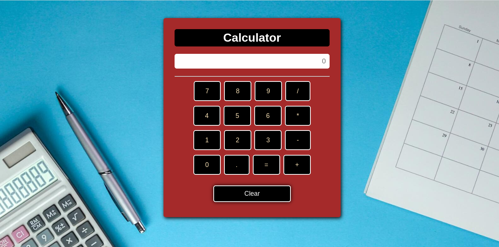

# Responsive Calculator

Welcome to the Responsive Calculator repository, where you'll find a fully functional calculator web application built using HTML, CSS, and JavaScript.

## Description

The Responsive Calculator is a user-friendly web application designed to perform basic mathematical calculations. Its responsive design ensures that the calculator adapts seamlessly to different screen sizes, providing an optimal user experience on desktops, tablets, and mobile devices.

## Features

- Perform addition, subtraction, multiplication, and division operations
- Responsive design for a consistent experience across devices
- Clear and intuitive user interface

## Screenshots

Include screenshots or GIFs showcasing the calculator's user interface and features.


## Usage

1. Clone the repository:

```bash
git clone https://github.com/your-username/responsive-calculator.git

🧮 Welcome to the Responsive Calculator project! This repository houses a fully functional web calculator that can perform a variety of mathematical operations. Built with HTML, CSS, and JavaScript, this calculator is designed to be responsive and adaptable, ensuring a seamless user experience across different devices. 

Perform addition, subtraction, multiplication, and division with ease using this user-friendly web calculator. Whether you're solving complex equations or simply crunching numbers, this calculator has got you covered. Its responsive design allows you to effortlessly access and utilize its functionality on desktops, tablets, and mobile devices. 

Embark on this web development project and explore the power of arithmetic calculations with our responsive calculator. Dive into the world of HTML, CSS, and JavaScript as you contribute to this exciting project. Let's create the ultimate web calculator together! 🌐🧮💻

Tags: calculator, web calculator, responsive calculator, mathematical operations, HTML, CSS, JavaScript, web development, project, arithmetic calculations.
